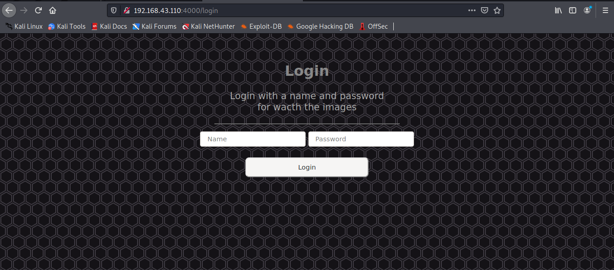
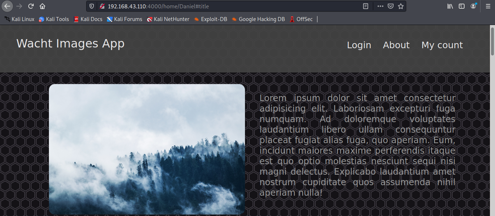

# Flask Login Images.

__This is a web application for login user in a database (sqlite3), and show some images. Also the user can change the name and the password.__

__Using flask module for the server and bcrypt for encrypt the password in the database.__

## Dependencies.

__Install the dependecies of this proyect with the requirements file in this proyect. Executing:__

```bash
$ pip3 install -r requirements.txt
```

## Run.

__For run execute:__

```bash
$ python3 app.py
```
__Or:__

```bash
$ python3 -m app
```

## Screenshots.



## Notes.

__This version is verbose for the queries for the database.__